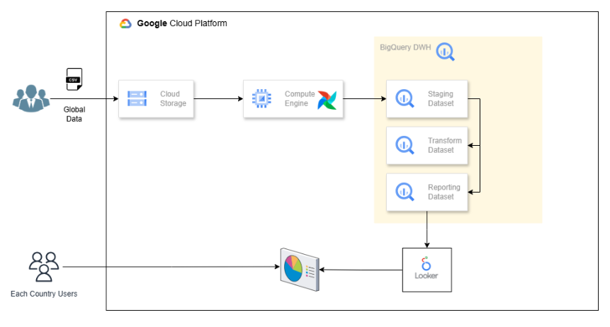
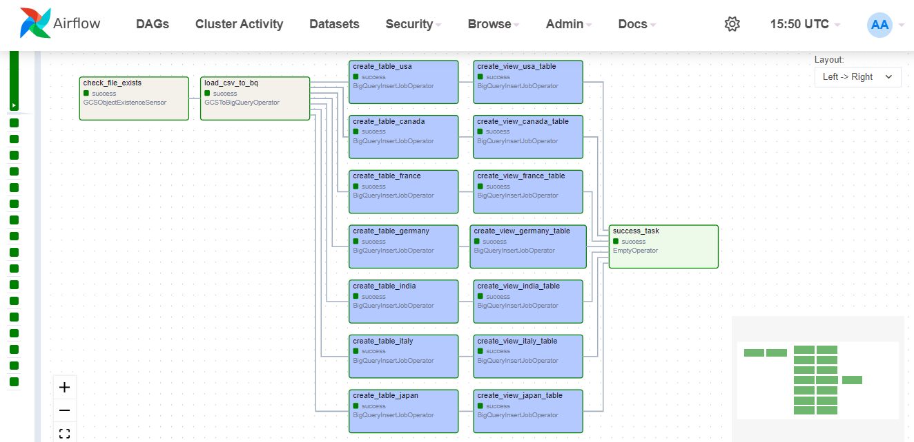

# ELT-Data-Pipeline-with-GCP-And-Airflow
 Build an ELT (Extract, Load, Transform) data pipeline to process 1 million records using Google Cloud Platform (GCP) and Apache Airflow. The pipeline extracts data from Google Cloud Storage (GCS), loads it into BigQuery, and transforms it to create country-specific tables and views for analysis. use compute engine for orchestrate the pipeline using Airflow.

 # Requirements
 The Medical Research Team receives a global health statistics file containing disease data for all
countries.
Each country's Health Minister should have access only to their respective country's medical data.
Additionally, they need the ability to analyze diseases for which no treatment or vaccination is
currently available.
# challenges
- The data is currently provided as a single file containing over 1 million records for all countries.
- Due to the confidential nature of the data, it is not feasible to share the entire file with
 everyone.
- Analysing such a large CSV file to extract meaningful insights is complex and inefficient.
# objective
Develop a robust data analytics solution to securely manage and filter this data, ensuring
restricted access and enabling efficient analysis of diseases without available treatment or
vaccination.
# features
- Extract data from GCS in CSV format.
- Load raw data into a staging table in BigQuery.
- Transform data into country-specific tables and reporting views.
- Use Apache Airflow to orchestrate the pipeline.
- Generate clean and structured datasets for analysis.

# Architecture

# Tools and services
1. Google cloud platform(GCP)
   - Google compute engine(Airflow)
   - Bigquery
   - cloud storage
2. Apache Airflow
   - Airflow with google cloud providers

# Source Data
## Global Health Statistics Data Containing over 1 million Records. load raw data from google cloud storage to global_data Dataset in Bigquery
  
  

# Airflow
## Connected Airflow using Compute Engine.

## Created Airflow Dag with Four Jobs
1. Check if the file exists in GCS
2. Load CSV from GCS to BigQuery
3. Create country-specific tables and store them in a list
4. create view for each country-specific table with selected columns and filter

# Airflow python script
 Includes sql query for views to get the data of each country which doesnt has vaccination for disease:
https://github.com/adhilahmd/ELT-Data-Pipeline-with-GCP-And-Airflow/blob/main/ELT_code.py
# Transform Tables
Transform data into country-specific tables. load data to Transform_dataset in Bigquery
- [transform_tables](transform%20tables)

  
